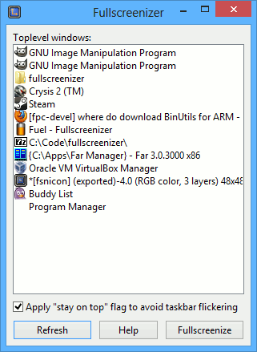

# Fullscreenizer
Fullscreenizer is a small tool to force a game in borderlees-windowed-fullscreen mode (basically remove the border from a game's window when it runs in windowed mode and resize it to cover the entire desktop using the above-all-windows bit flag).

The reason to do this is that some games have issues with running in fullscreen mode under certain configurations (the inspiration for this program was to make Crysis 2 run in my 42" TV which i use as a monitor connected to my laptop via HDMI - a known, widespread and unfixed bug prevents the game from running in fullscreen mode at anything other than 24Hz). 

